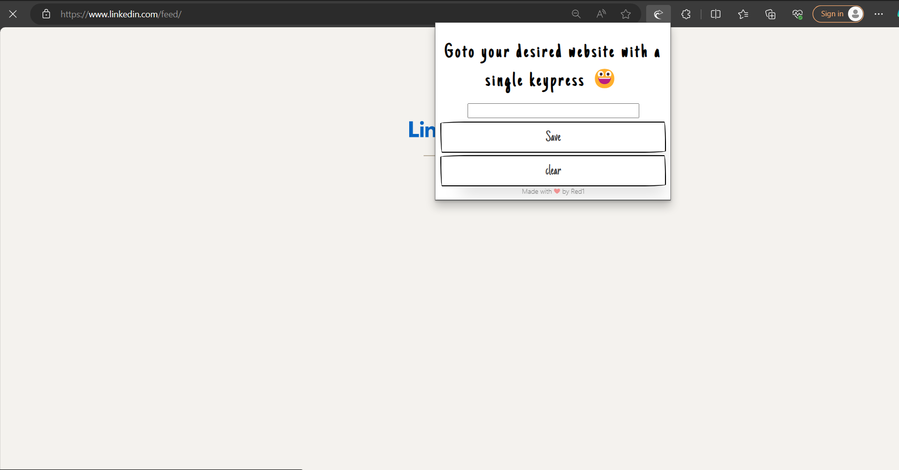

<h1 align="center" style="display: inline;">
    <b> GOTO EXTENTION : </b>
</h1>
&nbsp &nbsp 
<h3 style="display: inline;">Travel between any tab and your desired website with a single keypress</h3>
 
 

## Need
You are working on something on your browser, but from time to time you need to check your gmail if there are any new messages and then return to what you were doing.\
That's what this extension is for! :)

## HOW TO USE
- Click on the extension's icon and input the URL of the website you want to save or leave it blank to save your current tab as the target website.
- Save your selection by clicking on the designated button.
- Use the Alt+a shortcut to navigate to your saved website; Another keypress returns you back to your previous location.
- Click on "Clear" to reset.

## HOW TO ADD TO BROWSER
- Clone the repo
- Go to <b>manage extensions</b> on your browser
- Activate Developer mode
- Click on load unpacked and select the <b>Goto</b> folder 
<h2 align="center"><b>That's it. You're good to go. Enjoy 🙃</b></h2>
          